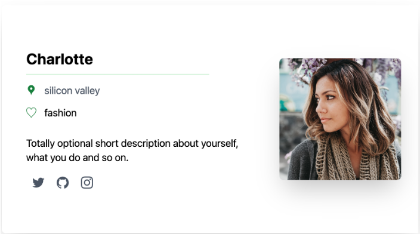

# [E-SInt](https://self-introduction-app.vercel.app/)

## 概要
自分の自己紹介カードを作成でき、同じ空間にいる人が作ったカードを閲覧できるwebアプリケーション。
 

### 背景
サークルの新歓や初対面の人と複数集まるイベントにおいて、数分前に聞いた名前や、趣味などを忘れてしまうことがあります。また初対面のため話のきっかけがなく、気まずい空気になってしまうことがあります。
そこで、ユーザー登録なく、簡単に自己紹介カードを作成し、その場で他の人が作った自己紹介カードを閲覧できるアプリケーションを開発しました。
 

### アプリ説明
スタート画面で位置情報取得を許可することでアプリケーションが開始されます。開始後は自分の自己紹介カードを作成することや、位置情報が同じである人が作った自己紹介カードを閲覧することができます。
自己紹介カードは12時間経過すると見ることができなくなります。またその場所から移動しても見ることができなくなります。

### 特長
#### 1. ユーザー登録不要
ユーザー登録をせず、位置情報取得を許可するだけで使用できるので、初対面の人とのイベントでも簡単にすすめられ、アプリケーションを利用することができます。

#### 2. 位置情報を利用したマッチング
位置情報を用いたマッチングをさせているため、その場にいる人だけが自己紹介を見ることができます。またその場限りなので、コミュニティーや場所に応じて簡単に自己紹介を変えられます。

#### 3. 使用機種に応じたレスポンシブデザイン
画面サイズに応じてデザインがレスポンシブに変更します。画面が小さい機種でも自己紹介カードが見やすいよう、スマホとパソコンではカードのデザインが変わるようになっています。

## 開発技術
### 活用した技術
#### フレームワーク・ライブラリ・モジュール
- Frontend: TypeScript, Next.js, Tailwind
- Backend:  Next.js, ApolloServer, Graphql
- Other:    Vercel, Firebase

#### その他
技術的な部分で、Graphqlについて学んでみたかったため、実際に実装し初めて使用してみました。 
画像保存の部分にはFirebaseと連携し、そのstrageに保存するようにしています。
